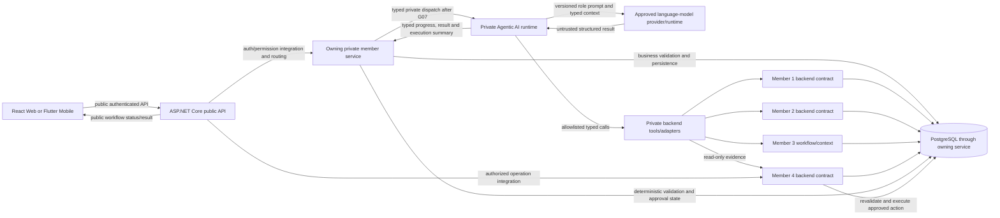

# Agentic AI implementation blueprint — v1

**Status:** target specification and implementation checklist. The repository
does not yet contain the v1 Agentic AI runtime, executable agents, production
tools, or model integration. This document describes what the team must build
and decide; it is not evidence that any item is implemented.

**Scope:** the four v1 responsibilities and workflows in
[`PROJECT_REQUIREMENTS.md`](../../PROJECT_REQUIREMENTS.md), the four
[member component contracts](../v1/README.md#component-and-agent-contract-map),
and the shared [Agentic AI contracts](architecture.md), [tool rules](tools.md),
[safety rules](safety.md), and [evaluation rules](evaluation.md).

## 1. What v1 Agentic AI is responsible for

BLUEVERSE v1 uses a bounded, multi-step language-model workflow to interpret a
domain objective, make a structured plan, request verified context through
approved tools, produce typed reports and recommendations, and hand those
results to ordinary application code for deterministic validation. The system
must preserve the source component's authority and expose progress and final
status through the public ASP.NET Core API to both clients. The owning member
service remains authoritative for business state and protected operations.

It is not a general-purpose chatbot, free-form autonomous operator, source of
truth for BLUEVERSE records, safety-rules engine, biodiversity model, or
government/emergency authority. A plausible model response is not proof that a
fact was retrieved, a rule passed, approval was granted, or an operation was
executed.

The v1 Agentic AI implementation begins only after all four `features/**`
component PRs are merged, integrated compatibility corrections are complete,
and G07 is accepted. Before G07, each member's private .NET service implements
its business workflow and typed private integration seam, including bounded
availability and safe `not connected`/unavailable behavior. The public API
receives only the authentication/permission and routing integration needed
to expose that service. Member branches do not implement prompts, model calls,
tools, orchestration, agents or AI-owned execution state. See the
[member integration boundary](../v1/agentic-ai-integration-boundary.md) and
[branch workflow](../v1/member-branch-workflow.md).

## 2. Terms and boundaries

| Term | Meaning in this project | Authority and limit |
|---|---|---|
| **Foundation language model / LLM** | A model used to interpret natural-language objectives and produce role-scoped structured plans, reports, or proposals. | Its output is untrusted. It does not own domain facts, permissions, safety thresholds, approval, or protected writes. The provider and model are not selected yet. |
| **Agent** | A configured role consisting of a responsibility, versioned input/output contract, instructions, allowlisted tools, limits, and workflow participation. | Distinctness comes from real role behavior and visible participation, not different names or copied prompts. Roles may use the same compatible model. |
| **Orchestrator** | The runtime that creates a plan, dispatches approved agent steps, validates handoffs, tracks dependencies, persists progress, and recovers or fails safely. | It may be a framework or project-owned code. That choice is open in [ADR-0007](../adr/ADR-0007-agentic-ai-framework.md). |
| **Tool** | A narrowly scoped server-side operation with a fixed schema that reads approved BLUEVERSE evidence or invokes a specifically authorized workflow capability. | Tools are explicitly allowlisted per agent, validated, least-privileged, time-bounded, and audited. Agents cannot invent tools or call arbitrary networks. |
| **Deterministic application logic** | Ordinary code that validates schemas, business constraints, data freshness, safety profiles, permissions, state transitions, approval and execution eligibility. | It is not an agent or an LLM. It rejects or blocks an unsafe or invalid model proposal regardless of model wording. |
| **RAG (retrieval-augmented generation)** | A pattern that retrieves passages from an approved document collection and supplies them as source context for model generation. | It is not required by the v1 requirements. No v1 document corpus, embedding model, vector store, chunk policy, or RAG deployment is selected. |
| **Embedding** | A numeric representation used to find semantically similar text or items. | No v1 requirement currently calls for embeddings. They are not needed for structured domain queries, normal filtering, or deterministic rules. |
| **Biodiversity ML inference** | The separate IT3091 model integration that produces biodiversity predictions. | Member 3 owns the BLUEVERSE private-service adapter and validated public result contract; Member 1 owns experience-facing consumption. It is ordinary v1 domain integration outside the Agentic AI runtime. An LLM must not invent or replace its predictions. |

## 3. Model and orchestration requirements versus open choices

The requirements require four meaningful agent roles and a complete, reliable,
evaluated workflow; they do not prescribe a vendor, model family, model size,
hosting mode, SDK, agent framework, or number of model instances. The formal
assignment permits a suitable model/framework/orchestration approach when its
choice is justified and the setup is reproducible.

### Required model capabilities

Select a suitable instruction-following language model (LLM) that can, under
the chosen runtime:

- follow the fixed role and workflow instructions without gaining authority;
- consume only the minimized, typed context needed by its assigned step;
- produce the role's versioned structured output reliably enough to validate;
- participate in tool selection or tool-call proposals that the runtime can
  match to a fixed allowlist and schema; and
- meet the team's documented privacy, latency, reliability, quota/cost and
  reproducible deployment constraints.

Native structured-output or function-calling support is useful, but it does
not replace application validation. If the selected model returns text that
must be parsed, malformed, extra, missing, or unauthorized fields are rejected
before they can affect a tool or workflow. Model confidence or self-reported
certainty is not a deterministic safety check.

The v1 inputs are text objectives plus structured business and environmental
records. Image/audio understanding, model fine-tuning, training on user data,
and embeddings are not current v1 requirements. Add one only through a
reviewed product requirement and the applicable architecture/security decision.

### Choices that must remain explicit until decided

| Decision | Current status | Evidence required before implementation is accepted |
|---|---|---|
| Model provider and model identifier/version | Open | Compare institution-provided or no-cost options that meet structured-output/tool behavior, privacy/retention, availability, rate limits, latency, quota, deployment and reproducibility needs. The assignment requires institution-provided or no-cost services; do not introduce a paid service without explicit institutional approval. Record the selected model identity/version and approved configuration. |
| Hosted API versus local/self-hosted model | Open | Document where prompts and data travel, who can access/store them, secret/configuration handling, runtime needs, startup order, service health, and how the assessed environment can use it. |
| One shared model versus different models by role | Open | Explain capability and cost trade-offs. One model may serve all four logical roles if each role still has its own enforced contract, prompt version, allowlist and evaluation. Four separate models are not required. |
| Framework versus custom orchestration | Open in proposed ADR-0007 | Evaluate fixed-step planning, delegation, typed calls, durable state, recovery, observability, security, testability, deployment and maintainability. The framework must not redefine project authority or workflow rules. |
| Sampling and generation settings | Open | Record selected model-specific parameters (for example temperature, output limit and structured-output mode), their purpose and regression evidence. Do not imply that sampling settings make business decisions deterministic. |
| Model fallback/update policy | Open | Define whether fallback is allowed, compatible model/schema constraints, version pinning, outage behavior, regression evaluation and rollback. Do not silently substitute a model. |
| Retrieval strategy | Baseline is structured tool retrieval; RAG is not required | Keep live canonical business facts behind typed tools. Introduce document RAG only for an approved source corpus and use case, with its own security, provenance, evaluation and architecture decision. |
| Prompt, schema and policy versioning | Required to design; exact format open | Version each role's instructions and input/output/tool schemas; persist the versions needed to explain and reproduce a run without persisting hidden reasoning. |
| Context limits and data retention | Required to design; exact values open | Bound input, context, output, plan steps and tool calls; minimize personal data; define structured-state retention and provider-side handling. Never persist hidden reasoning, secrets or irrelevant personal data. |

Resolve material architecture choices in accepted ADRs. ADR-0007 covers the
framework/orchestration decision. ADR-0008 covers durable workflow-state
design. If the model provider, hosting, retrieval corpus/RAG, or data-retention
choice materially changes architecture or risk, record it in an additional
appropriately named ADR rather than hiding it in a prompt or implementation
note. Do not mark proposed ADRs accepted before evidence and implementation
exist.

## 4. Retrieval: authoritative tools first; RAG only for an accepted need

### v1 baseline

The agents need current, permission-appropriate BLUEVERSE facts such as
destination/offering identity, schedule and availability, normalized marine
conditions, activity suitability, current operational state, and workflow
status. These are structured, changing application records with an owner and
freshness rules. Retrieve them through narrowly scoped, allowlisted backend
tools that call the owning component boundary. Preserve source identity,
timestamps, version and unavailable/stale status in each report.

This tool-based retrieval is not the same architecture as RAG. It does not need
an embedding model or vector database. PostgreSQL queries, domain APIs, filters,
geospatial queries and deterministic rules remain the right mechanisms for
canonical records and eligibility checks. Do not use semantic similarity to
decide if an experience is available, whether a safety threshold passes, who
may approve, or what state transition is allowed.

**v1 decision from current evidence:** RAG, embeddings and vector storage are
not baseline deliverables. The v1 contracts name live component data and
approved tool access, but do not identify a governed collection of long-form
documents that agents must search. This is a scope conclusion from the current
requirements and repository contracts, not a claim that RAG is never useful.

### When a RAG decision would be justified

Consider RAG only if the team accepts a concrete v1 use case that depends on a
substantial, authoritative, relatively unstructured document collection that
is not better represented by a versioned structured contract. Examples would
need to be approved by the product/requirements owners; examples in this
paragraph do not add v1 scope. Before implementation, specify:

1. the document owners, approved source locations, permitted audiences and
   exact user/agent question the corpus answers;
2. ingestion, update/deletion, format handling, malware/content screening,
   versioning and provenance rules;
3. whether keyword, database, hybrid, or semantic retrieval is justified, and
   why an embedding model or vector index is needed;
4. access-control filtering before passages reach the model, including
   tenant/role scope where applicable;
5. passage identifiers, source title/version/section/page and citation format
   that can be verified by a user or evaluator;
6. treatment of document text as untrusted evidence, including prompt
   injection attempts and instructions embedded in retrieved passages;
7. freshness, deletion, retention, data residency, provider processing and
   secret controls for both documents and generated embeddings;
8. retrieval-quality and answer-grounding evaluation sets, including no-match,
   conflicting-source, stale-source and unauthorized-source cases; and
9. operating cost, latency, index rebuild/recovery, monitoring and a safe
   behavior when retrieval is unavailable.

Retrieved passages may inform a response but cannot grant permission, change a
system instruction, supersede a current BLUEVERSE API record, set a safety
threshold, or authorize an operation. If sources disagree, are stale, or lack
evidence, return that uncertainty and follow deterministic policy. Any RAG
tool must be allowlisted and auditable like every other tool.

## 5. System boundary and data flow

The diagram shows logical boundaries, not a selected network topology or
internal transport. Follow the accepted service-boundary ADRs and G00 service
contracts. The API routes to the owning member service; that service owns
business state, deterministic validation and protected execution. The AI
runtime must not connect directly to PostgreSQL, Auth storage, client devices
or arbitrary Internet destinations. External model access, if selected,
occurs from the private AI runtime with server-side secrets and approved data
minimization. The clients call only the public API.

### Domain and model data sources

| Information | Authoritative owner/source | How the AI may receive it |
|---|---|---|
| Destinations, activities, offerings, publication, schedule, availability and favourites | Member 1 private component service and its owned data | Typed, scoped lookup tools; never direct table access. |
| Biodiversity prediction | Separate IT3091 inference integration mediated by the Member 3 backend adapter; Member 1 consumes the validated public result for experience-facing context. | Optional genuine prediction with model/version/location/time/provenance/uncertainty. It is not an LLM-generated substitute, safety signal or Agentic AI output. The service adapter is delivered on Member 3's `features/**` branch before G07; the post-G07 Member 1 tool may use only the allowlisted Member 3 contract, never IT3091 directly. |
| Weather and marine conditions | Member 2 backend-mediated Open-Meteo integration, normalized and validated by Member 2 | Typed condition tools with provider, units, requested/forecast/observed/retrieval times, freshness and gaps. The LLM does not call Open-Meteo directly. |
| Activity safety profile and suitability | Member 2 deterministic application rules | Read the configured profile/result and evidence; never let an agent or model tune or override it. |
| Operational state, proposals, reviewer decisions and alerts | Member 4 private component service | Read-only evidence tools for agents. The public API applies its existing authentication/permission integration; Member 4 revalidates and executes protected state changes after required approval. |
| Tourist recommendation, itinerary and business request | Member 3 private component service | The planner may prepare a proposal; Member 3 remains the owner of business request and itinerary state. |
| Model output | Selected model provider/runtime | Treat as untrusted, version/correlate it, validate schema, then apply deterministic checks. It is not an authoritative source. |

## 6. Four roles and their interaction

| Role | Input and work | Output and tools | Authority it does not have |
|---|---|---|---|
| **Planning & Coordination (Member 3)** | Receives a validated objective, workflow identity, scope, limits and resume state; creates a structured plan and assigns configured specialist steps; tracks prerequisites and assembles validated reports. | Versioned plan/step status and assembled result. It may invoke only the roles allowed by the workflow policy: M1/M2 for coastal planning context, and M1/M2 followed by M4 for an operational assessment. | Cannot invent a role, skip a required dependency, change source data, perform deterministic safety decisions, approve or execute an operation. |
| **Marine Conditions Intelligence (Member 2)** | Receives a scoped location, activity/period and requested evidence factors; obtains relevant normalized conditions and profile/suitability context. | Source-aware report with units, source, forecast/observation/retrieval times, freshness, gaps and the existing deterministic suitability result. Read-only tools. | Cannot select safety thresholds, turn `UNSUITABLE`/`UNKNOWN` into safe, or issue a maritime warning or closure. |
| **Coastal Experience & Biodiversity (Member 1)** | Receives relevant canonical IDs, time/location and information need; returns published offering, schedule, availability, operational context and optional biodiversity information through the Member 3 validated prediction contract. | Typed sourced report; biodiversity result only when the Member 3 adapter returns a valid genuine prediction. Its post-G07 read-only tool handler uses the approved public/typed contract and never contacts IT3091 directly. | Cannot fabricate availability/prediction, expose unpublished/private data, or treat probability/suitability as observed presence, safety clearance or operational authority. |
| **Safety & Operations (Member 4)** | Receives the objective, plan, validated specialist context, current operation and fixed allowed-action/policy envelope; prepares an assessment and proposal. | Structured recommendation, evidence references, uncertainty and proposed action/alert when supported. Read-only evidence tools. | Has no approve, publish, suspend, cancel or execute tool. Cannot decide its own approval requirement or change managed state. |

Each role contract is detailed in the
[v1 agent documents](../v1/README.md#component-and-agent-contract-map).
The runtime may share a model across roles, but it must preserve the
role-specific schema, permission set, context and observable step. A workflow
with cloned prompts and no distinct participation does not meet the contract.

### Runtime dependency order

For the operational assessment, the planner creates the persisted plan;
independent Member 1 and Member 2 evidence steps can run in parallel when the
plan and configured policy allow it; the planner validates/assembles their
reports; then the Member 4 agent prepares its read-only proposal. Application
code validates the result and may pause for an authorized human reviewer.
The Member 4 service rechecks the authorized actor context, target version,
current state and allowed transition before any protected operation; the
public API provides the authentication/permission integration. If required
evidence is absent or invalid, the outcome is blocked, requires revision, or
safe failure according to the accepted state contract.

For a tourist recommendation, the planner coordinates Member 1 and Member 2
context, then application-owned deterministic constraints determine eligible
items before a recommendation/itinerary result is returned. Normal tourist
recommendations do not require staff approval. Missing or stale evidence stays
visible; deterministic `UNSUITABLE` candidates cannot re-enter through model
assembly.

This is the runtime dependency flow. The post-G07 code branch sequence is a
separate development plan: AI-00 runtime foundation, M1/M2 specialists in
parallel, M3 planner, M4 safety proposal, and the complete golden-flow
evaluation. See [member branch workflow](../v1/member-branch-workflow.md#agentic-ai-work-after-g07).

## 7. Agent call contract, prompts and structured results

Before each model call, the runtime must assemble only the minimum validated
context needed for that role. The context must identify the workflow and step,
role/schema/prompt versions, allowed tools and bounded limits. It must not
include credentials, hidden reasoning, unrelated personal data, or unfiltered
records the role cannot access.

For each role, implementation must version and review:

- instruction/prompt template and its intended responsibility;
- typed input schema, required/optional fields, validation and size limits;
- typed output schema, enums, references, provenance and uncertainty fields;
- tool names, schemas and authorization grants;
- maximum plan steps, model calls, tool calls, wall-clock duration, input and
  output/context sizes, retry count and any provider-specific quota; and
- compatible model identifiers/settings and regression evaluation evidence.

Treat objectives, catalogue descriptions, provider fields, retrieved passages,
tool results and prior model output as untrusted data. Keep them in clearly
delimited typed fields; do not concatenate them as new governing instructions.
Prompt instructions cannot grant a permission or tool. Validate every
proposed tool call against the agent identity, allowlist, input schema, user
authorization and current workflow state immediately before dispatch.

Model outputs are parsed and validated against the exact versioned schema.
Reject invalid enum values, unknown identifiers, invented evidence, missing
required provenance, extra fields that imply authority, and content that
cannot be linked to an approved source. Persist the validated structured
output or minimum auditable summary, not hidden reasoning or a raw prompt
transcript. Keep output versions so evaluation and recovery can identify the
contract used.

## 8. Tool execution contract

For every production tool, the owning team must document and implement:

1. stable tool ID/version, purpose, owning service and source of authority;
2. exact authorized agent roles and permission context;
3. typed input/output schemas, validation, identifier scope and data
   minimization;
4. whether it is read-only; any side effect must be separately authorized,
   designed as an application operation and protected by policy/approval;
5. timeout, retryable errors, finite retry/idempotency policy and cancellation;
6. response freshness, provenance, unavailable/malformed behavior and schema
   compatibility;
7. auditable fields correlated to workflow, step, agent, tool, start/end or
   elapsed time, outcome, error category and retry count; and
8. redaction and retention rules for request/response details.

The currently documented v1 role tools are read-only. The model may request
only a tool already granted to its role. The runtime
resolves the tool ID in a server-owned registry and invokes a fixed adapter;
it never executes model-supplied code, SQL, shell, URL, HTTP method, hostname,
or arbitrary arguments. Tool output is untrusted until validated. Read-only
agent access is the v1 default, especially for Member 4.

Candidate operation names in [`tools.md`](tools.md) are logical examples, not
routes or implemented methods. Exact routes, schemas and public use must be
recorded in the endpoint catalog if they change the public API. Internal tool
contracts stay private and must not become client routes.

The selected map API is not a default model source or v1 Agentic AI tool.
Member 1's agent reads validated destination and location context through its
Member 1-owned tools; it does not call a map provider, arbitrary URL or
map-provider SDK. If a later accepted workflow needs map operations, define a
separate allowlisted server-side tool, minimization/provenance rules and
evaluation, and preserve the Member 1 catalogue as the destination authority.

## 9. Business state, AI execution state and recovery

Maintain two related but distinct records:

- **Business workflow state** is owned by Members 3/4 and remains meaningful
  without an AI run. It includes the request or assessment, actor, business
  status, proposal/decision references, managed target and result.
- **AI execution state** is logically owned by the Agentic AI runtime after
  G07. Its physical storage owner and call path remain open in ADR-0008; the
  runtime must use an approved backend state/persistence boundary and must
  not connect directly to PostgreSQL. It records workflow type/ID, initiator
  reference, objective needed for work,
  structured plan, current/completed steps, role/schema/prompt/model versions,
  validated structured outputs or tool summaries, validation references,
  errors/retries, approval linkage, final outcome and timestamps needed for
  operation/recovery/audit.

Use the agreed workflow ID/correlation and typed references to connect them;
do not treat a member business row as proof of an AI execution. Exact tables,
keys, ownership, state transitions, retention, restart/resume and concurrency
rules must be accepted through [ADR-0008](../adr/ADR-0008-agent-workflow-state.md)
and the PostgreSQL/EF Core design before implementation is considered ready.

All loops and effects are bounded. Define which failures may be retried, a
finite retry count/backoff, overall deadline, cancellation semantics,
idempotency/correlation key, duplicate dispatch behavior, and which states
are safely resumable. On resume, use persisted validated state rather than
model memory. Revalidate source freshness, permission, workflow state and
proposal eligibility after recovery. A repeated dispatch must not double
write business state.

Record explicit outcomes for not connected, unavailable, timeout, malformed
input/output, invalid tool result, stale/missing evidence, blocked validation,
revision required, rejection, retry exhaustion and safe failure. A failure
must never silently degrade into a fabricated normal result. Record
`SAFE_FAILURE` (or the finalized equivalent) and perform no protected side
effect when safe recovery is impossible.

## 10. Deterministic validation, approval and protected actions

Application-owned validation occurs after relevant model/tool results and
again immediately before an approved protected mutation. It checks at least
the applicable schema, required evidence, source freshness, Member 1
publication/schedule/availability, Member 2 profile and deterministic
suitability, Member 4 current state and allowed transitions, actor permission,
proposal version and approval requirement.

Member 4 agents can only propose. A high-impact proposal pauses pending an
authorized human decision. Approve/reject/request-revision must be validated
for permission, current proposal and decision state. Reject/revision must not
execute. Approval requires fresh revalidation and transactional application
through the Member 4 service, with business and audit/history state kept
consistent. The public API remains the client-facing route and permission
integration point. The LLM never executes the change.

Normal tourist recommendations do not need staff approval, but eligibility,
availability and safety remain deterministic. The model cannot change
configuration thresholds or override `BLOCKED`, `UNSUITABLE`, `UNKNOWN`,
missing-required-evidence, revoked authorization, or unavailable state.

## 11. Security, privacy and external model integration

- Keep the Agentic AI runtime and tools private behind the owning member
  service and public ASP.NET Core API boundary; clients never call model
  providers, agents, private tools or internal health endpoints.
- Use a private, authenticated service-to-service boundary and least-privilege
  service identity. Do not give an agent database credentials or broad
  service/network access.
- Keep model/provider keys in approved runtime secret configuration; never in
  source, prompts, logs, clients or workflow records. Rotate/configure them by
  the repository secret-management process.
- Send only minimized, permission-appropriate context. Before selecting a
  hosted provider, review its data retention/training, processing region,
  contractual terms, quotas, rate limits, availability, and institution/no-cost
  eligibility for the assessed project.
- Do not send access tokens, passwords, secret values, unnecessary account
  identifiers, private favourites or unrelated itinerary notes to the model.
- Treat model output, tool output, provider data and (if later accepted) RAG
  documents as untrusted. Prevent prompt injection, unauthorized tool use,
  unsafe URL fetches, schema confusion and cross-user data exposure.
- Store only structured workflow state, decision/audit evidence and minimized
  tool summaries. Never store hidden reasoning or chain-of-thought.
- Use bounded timeouts, request/call/step limits, finite retries and safe
  cancellation. Keep model-provider health independent from API liveness,
  database readiness, Open-Meteo health and biodiversity inference health.
- Return coarse safe status to authorized public clients; do not expose private
  hostnames, provider secrets, prompts, stack traces or raw internal errors.

The chosen provider/runtime must be supportable with reproducible setup and
startup instructions. The formal assignment requires institution-provided or
no-cost services for the submission. A hosted provider remains a third-party
dependency and must have availability, rate/cost and data-handling failure
behavior; a local model shifts requirements to runtime resources, model assets,
startup, health and deployment size. Neither option is selected here.

## 12. Observability and operations

For each execution, correlate the business workflow ID and AI execution/step
IDs without leaking personal data. Capture the minimum structured evidence
needed to explain operation and measure the assignment's performance concerns:

- workflow/step/role and contract versions;
- model provider plus model ID/version and relevant configuration version;
- call/tool outcome, error category, retry count and safe-failure reason;
- start/end or elapsed time for model, tool, step and total workflow;
- token/usage or provider quota/cost data only when available and safe to
  retain; and
- validator/approval/execution references and final state.

Do not log secret values, full sensitive request bodies, hidden reasoning or
raw retrieved records by default. Define redaction, retention, access control
and dashboards/alerts with the schema and deployment design. Record actual
latency, concurrency, success/failure and external dependency measurements;
do not state targets as measured results.

Availability has two parts: an optional bounded server-to-server readiness
observation and the authoritative outcome of each actual dispatch. Preserve
`GET /api/health` as API liveness and database readiness as a separate signal.
A recent healthy model probe cannot guarantee the next model call will work.
Member workflow responses must expose safe `NOT_CONNECTED`/unavailable or
equivalent state without fabricating a report. Do not add a public AI endpoint
without the API catalog and UI integration work required by repository rules.

Deployment documentation must identify runtime/model/framework requirements,
approved environment-variable names (not values), secret setup, startup and
shutdown order, health behavior, network boundaries, provider quotas and
recovery. Keep local development, evaluation fixtures and live model/provider
execution clearly distinguished.

## 13. Evaluation and acceptance gates

Use [`evaluation.md`](evaluation.md), the [testing strategy](../testing/strategy.md),
and [quality and delivery evidence](../v1/quality-and-delivery.md). Before
release, freeze and execute:

- the complete operational-assessment golden case with four distinct roles,
  correct delegation, allowlisted tools, persisted state, deterministic
  validation, authorized human decision, protected execution only after
  approval and auditable final status;
- a tourist recommendation/itinerary case with deterministic candidate
  eligibility and no staff approval;
- malformed/extra/incomplete schemas, invented IDs/facts and invalid tool
  calls;
- direct and indirect prompt injection through objectives, provider fields,
  tool output and any later accepted RAG source;
- each role's allowlist, unauthorized access, cross-user isolation and attempt
  to bypass permissions or call protected tools;
- missing, stale, contradictory and unavailable Member 1/2/4 evidence;
- model/provider and tool timeout, bounded retries, cancellation, duplicate
  dispatch, crash/restart/resume and retry exhaustion;
- approval required, approve, reject, request revision, expired/stale proposal,
  unauthorized/duplicate/concurrent decisions and absence of side effects;
- deterministic controlled fixtures separately from live model/provider
  runs, with the model/provider/version and settings recorded; and
- actual timing, reliability, failure, concurrency and external-service
  measurements in the evaluation report.

All safety, authorization, state, schema, audit, and side-effect claims require
deterministic assertions and appropriate human review. An LLM judge may only
supplement them. A plausible answer cannot compensate for a missing role,
failed rule, unsafe action, incomplete audit or unauthorized data exposure.

## 14. Implementation sequence and decision checklist

The component branch and integration gate in
[`member-branch-workflow.md`](../v1/member-branch-workflow.md) is binding:

1. Complete all four `features/**` member components and verify compatibility
   on `dev`; pass G07.
2. **AI-00:** accept model/provider/retrieval, framework, typed shared schema,
   tool, durable state, safety, deployment and evaluation decisions; build
   runtime foundation on `agentic-ai/runtime-foundation`.
3. **AI-01a/AI-01b:** implement the Member 1 and Member 2 read-only specialist
   agents in parallel after AI-00.
4. **AI-02:** implement Member 3 planning, delegation and assembly using the
   accepted specialist reports.
5. **AI-03:** implement Member 4's proposal-only safety/operations role with
   no approval or execution tool.
6. **AI-04:** run the end-to-end golden workflow, tourist path, full negative
   and recovery evaluation, deployment/setup and release evidence.

This sequence is for the AI branches after G07. It does not impose an order on
the four member feature branches or make member integrations wait for the
actual AI runtime. The branch names and gates are tracked in the shared
[branch workflow](../v1/member-branch-workflow.md#agentic-ai-work-after-g07).

Before declaring v1 Agentic AI implemented, reviewers should be able to
answer “yes” to each item:

- [ ] G07 passed and all four member services, clients and API integration seams are integrated.
- [ ] ADR-0007 and ADR-0008 are accepted with reviewed implementation evidence.
- [ ] The selected model/provider/runtime meets the documented capability,
      privacy, reproducibility, no-cost/institution and deployment constraints.
- [ ] RAG has an explicit decision: not used for the v1 baseline, or accepted
      with a governed corpus, access control, citations and retrieval tests.
- [ ] All four agent role/input/output/tool/prompt versions and limits are
      explicit and tested.
- [ ] Workflow state is durable, correlated, recoverable and separate from
      Member 3/4 business state; hidden reasoning and secrets are absent.
- [ ] All model/tool outputs are validated and all protected business rules
      remain deterministic.
- [ ] Member 4 agents cannot approve or execute; authorized humans decide, the
      Member 4 service revalidates/executes, and the public API supplies its
      authentication/permission integration.
- [ ] Not-connected/outage/malformed/retry-exhausted paths return safe state
      with no fabricated success or unauthorized side effect.
- [ ] Both clients observe the same public workflow identity and authorized
      outcome; internal AI stays private.
- [ ] Golden, negative, security, recovery, live/fixture and performance
      evidence is executed, reviewed and retained.
- [ ] Setup, startup, health, secrets, provider/model requirements and
      deployment instructions are reproducible.

## 15. Glossary

| Term | Plain-language definition |
|---|---|
| **Agentic workflow** | A bounded process that assigns several structured tasks to role-specific agents and coordinates the results across persisted steps. |
| **Allowlist** | The server-owned set of exact tool operations a particular role is permitted to request. Anything outside it is rejected. |
| **Embedding** | A model-generated vector used to compare semantic similarity between text or other items. It is relevant only if an accepted retrieval/search use case needs it. |
| **Foundation model** | A broadly trained model adapted at runtime with role-specific context and instructions; this term does not name a particular provider or guarantee correctness. |
| **Function/tool calling** | A model's structured proposal to invoke a named operation. The runtime still checks identity, schema, permission, policy and current state before execution. |
| **Hallucination** | A model-generated statement that is unsupported or incorrect. BLUEVERSE prevents it from becoming authority by requiring sourced evidence, schemas and deterministic checks. |
| **LLM** | Large language model. In this project, a possible engine for bounded language understanding and structured generation, not the database or business rules. |
| **Prompt injection** | Untrusted text attempts to change governing instructions or make a model/runtime disclose data, misuse tools or bypass policy. |
| **RAG** | Retrieval-augmented generation: retrieve approved document passages and provide them as context to the model. It is not the v1 baseline. |
| **Structured output** | A machine-readable result conforming to a versioned schema, such as a validated JSON object. Well-formed output can still be factually wrong and must be checked. |
| **Vector database/index** | Storage and search infrastructure for embeddings. It is not required for BLUEVERSE's current structured, live domain lookups. |
