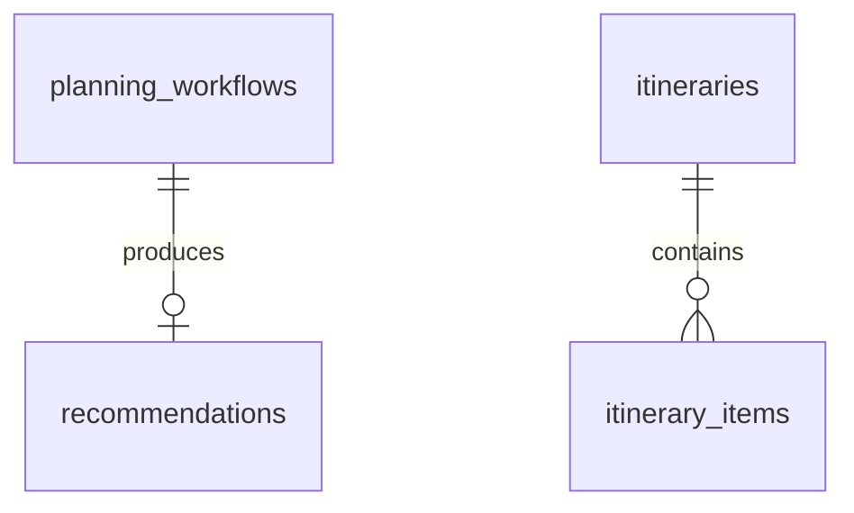

# Schema Design Status

Auth and Coastal Planner have PostgreSQL/EF Core schemas with checked-in
migrations under their owning service directories. The other member-owned
business schemas and shared Agentic AI workflow-state tables remain deferred.

The Auth schema contains users, roles, permissions, device installations,
active sessions, session lifecycle logs, rotating refresh-token records and the
two many-to-many assignment tables. It includes unique email/name/code
constraints, one active session row per user/device pair, session-version
state, absolute expiration, foreign-key cascade behavior, token-version
revocation state, system-role protection and `CreatedAt`/`UpdatedAt` fields
where applicable. Auth enforces a maximum of five active account sessions for
one installation and five active sessions per account across installations.

## Auth session tables

| Table | Important fields and constraints |
|---|---|
| `DeviceInstallations` | Server-issued `DeviceId` primary key, hashed `DeviceKeyHash`, legacy marker, last-seen and revocation timestamps. The device key is never stored in plaintext. |
| `ActiveSessions` | Only currently active session rows; unique `(UserId, DeviceId)`, JWT `SessionVersion`, `CreatedAt`, `LastSeenAt`, absolute `ExpiresAt`, `RememberMe` and a foreign key to the installation. |
| `UserSessionLogs` | Append-only ended-session records with the original lifecycle fields, `EndedAt` and bounded `EndReason`; never used for authentication. |
| `RefreshTokens` | Unique SHA-256 token hash, session/family IDs, issued and expiry timestamps, consumed/revoked timestamps, replacement link and revocation reason. Each row references exactly one active session or session log. Raw refresh tokens are never persisted. |

`20260921033902_AuthSessionLifecycle` backfills legacy device-installation
rows from existing `UserSessions` before adding the installation foreign key
and gives pre-existing sessions a one-day migration expiration.

`20260921133008_ActiveSessionsAndSessionLogs` separates active and ended
sessions without losing history. Existing valid rows are moved to
`ActiveSessions`; revoked or expired rows are moved to `UserSessionLogs`; and
refresh-token references are transferred to the corresponding log rows when a
session is archived.

## Coastal Planner tables

`services/coastal-planner/Data/Migrations` owns the `coastal_planner` schema.
Actor IDs are stored as opaque UUID references; the planner does not add
cross-service foreign keys to Auth or other components.

| Table | Important fields and constraints |
|---|---|
| `planning_workflows` | Workflow ID, actor ID, type, status and lifecycle timestamps; indexes on actor, status and creation time; status check limits values to `PENDING`, `PROCESSING`, `COMPLETED` and `FAILED`. |
| `recommendations` | Unique workflow ID, owner ID, destination, UTC window, duration, candidate snapshot and uncertainty-note snapshot; checks enforce a positive window and duration; indexed by owner. |
| `itineraries` | Owner ID, title, optional description, UTC window, optimistic `ConcurrencyVersion`, and created/updated timestamps; check enforces end after start; indexed by owner and creation time. |
| `itinerary_items` | Ordered destination/activity/offering reference, UTC schedule, last known availability/suitability/operations states, and advisory; cascades from its itinerary; unique `(ItineraryId, OrderIndex)` and checks enforce a non-negative order and positive schedule interval. New items begin as `UNKNOWN`. |
| `biodiversity_predictions_cache` | Destination/activity, validated model/version, prediction timestamp, expiration, prediction snapshot and limitations; indexed by destination/activity and expiration. Only valid `AVAILABLE` inference responses are cached. |

The workflow owns at most one recommendation result. Itinerary reads and
mutations are scoped by `OwnerUserId`; recommendation and workflow reads are
scoped by their owner/initiator IDs. Cached predictions expire six hours after
the source inference timestamp and are never synthesized when the ML endpoint
is unavailable.

The eventual schema documentation must include:

- ER diagram
- table definitions
- keys
- relationships
- constraints
- indexes
- audit fields
- migration strategy
- seed data
- Agentic AI workflow-state tables, if required

The v1 target schema must support four member-owned domains:

- Coastal experiences: destinations, activities, offerings, schedules,
  statuses, favourites and relevant biodiversity context.
- Marine conditions and safety: sourced snapshots, freshness, activity
  safety profiles and deterministic suitability results.
- Coastal planning: recommendation workflows and result snapshots,
  itineraries and ordered items (implemented in the Coastal Planner feature
  branch; cross-component acceptance is still pending).
- Coastal operations: assessments, proposals, operational state, approval
  decisions, advisories, alerts and execution history.

Shared structured Agentic AI workflow state must retain only the objective,
plan, steps, outputs or auditable summaries, validation, errors, bounded
retries, approvals, result and timestamps required to operate and audit the
workflow. Do not store hidden reasoning, passwords, bearer tokens or
unnecessary sensitive data. The remaining member-owned schemas still require
their own migrations. Feature-branch implementation is not evidence of shared
G00/G07 acceptance or merged deployment.

See the [v1 component and agent index](../v1/README.md). Business-domain
schema should be introduced with its owning implementation rather than
prematurely in the v0 foundation.
