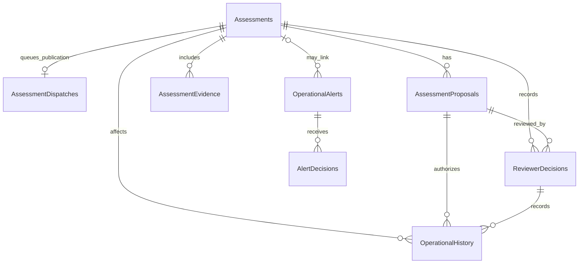

# Schema Design Status

The [Coastal Operations follow-up](../v1/coastal-operations-record-experience.md)
adds Assessment.Title/TimeZoneId, OperationalAlert.TimeZoneId and an IANA-seeded
TimeZoneLocations catalogue. Titled unlinked drafts retain an empty target
sentinel until linked; publication rejects it.

The final business schema is still deferred, but the current Auth foundation
defines a PostgreSQL/EF Core schema with checked-in migrations under
`services/auth/Data/Migrations`.

The Coastal Operations service has a PostgreSQL-backed EF Core context with
the provisional `coastal_operations` default schema and checked-in migrations.
Shared G00 still needs to ratify schema provisioning, a dedicated database role
and credential delivery. The service currently uses the configured Compose
database credentials. No live PostgreSQL migration execution has been
verified on this branch.

## Coastal Operations tables (branch-local, provisional)

The current context defines these tables in `coastal_operations`:

| Table | Purpose and integrity controls |
|---|---|
| `Assessments` | Caller-owned business assessment/workflow, title (max 160, duplicate titles permitted), starting in `DRAFT`, target reference (empty only for unlinked drafts), UTC period and nullable selected zone, AI dependency outcome, bounded JSONB snapshots of optional Member 1–3 results collected on submission, initiator and optimistic version; cancellation tombstone; unique workflow ID and status/period/version/lifecycle constraints. |
| `AssessmentProposals` | Versioned proposal references and validity; unique assessment/version and a maximum 30-minute validity constraint. |
| `AssessmentEvidence` | Private image metadata, immutable assessment version, uploader, SHA-256, inspection state (AVAILABLE/EXPIRED/REMOVED), nullable RemovedAt/ContentDeletedAt and 365-day expiry; a removal-state check requires a timestamp for tombstones; content bytes live in the private evidence volume. |
| `ReviewerDecisions` | Human decision for a proposal version; unique proposal/version. |
| `TargetOperationalStates` | Member 4-owned state and optimistic version by target type/ID; unique target reference and state constraints. |
| `OperationalHistory` | Target state transitions with assessment/proposal/decision references and correlation ID. |
| `OperationalAlerts` | Draft and published alert content, target, severity, `PUBLIC`/`OPERATIONS` visibility, lifecycle, effective period and optimistic version; proposed drafts can be logically withdrawn with actor/time tombstone fields. |
| `AlertDecisions` | Audited publish/resolve/expire decisions. |
| `IdempotencyRecords` | Actor/operation/key-scoped request digest and original response; unique scope. |
| `OperationsAudit` | Resource/action/actor/correlation and timestamp; nullable actor name (100), record title (200), readable summary (512), required ActorRolesJson/ChangesJson JSONB arrays with an array-type check. New entries capture allowlisted before/after values and historical display identity atomically with the mutation. |
| `TimeZoneLocations` | IANA identifier primary key (max 100), country code/name, location, coordinates, description, source version and active flag. 419 seeded choices including UTC, from IANA 2026e zone.tab/iso3166.tab. Assessment/alert nullable zone references use restrictive foreign keys and indexes. Date-specific rules come from the OS, not a stored fixed offset. |

Migration `20261002081218_CoastalDetailedAudit` adds the audit snapshots above.
Existing events receive empty arrays and nullable details: no names, roles or
field history are reconstructed. Sensitive provider payloads, hidden reasoning,
credentials and image bytes are excluded. The same scoped audit access/retention
applies. Down retains original event rows but drops the new detail columns.
See [ADR-0024](../adr/ADR-0024-coastal-detailed-audit-snapshots.md). Generated SQL
and model consistency were checked; live PostgreSQL execution remains unverified.

Migration `20261001204558_CoastalDraftEvidenceRemoval` adds nullable removal and
content-deletion timestamps, allows REMOVED, and constrains its timestamp/state
pair. Existing rows remain unchanged. Draft removal commits evidence metadata,
assessment version and audit atomically before deleting private bytes. Pending
cleanup is retried in batches of 50 by the existing retention worker. Audit
queries retain removed evidence IDs; current details, publication snapshots and
attachment counts exclude removed images. Rollback maps removed rows to EXPIRED
because deleted private content cannot be recovered. Logs reuse existing tables
and indexes; they introduce no duplicate audit storage or content snapshots.
See [ADR-0023](../adr/ADR-0023-coastal-draft-evidence-removal.md).

Migration `20261001123722_CoastalOperationsNamedDraftsAndTimeZones` adds the
catalogue, assessment Title and both selected-zone columns. It backfills titles
from trimmed objectives (first 160 characters), preserves existing UTC instants
and leaves legacy zones null. It does not invent producer references or create
dispatch records. New clients submit one zone plus two local times; server
validation resolves each instant and rejects invalid or ambiguous clock times.

Migration `20261001102110_CoastalOperationsPublicationDispatch` adds `AssessmentDispatches`:
one unique assessment envelope, immutable JSONB published payload, workflow and
actor/correlation IDs, delivery status/attempt count, finite lease/retry time,
created/updated timestamps and optimistic version. It is business delivery
state; no agent plan/steps/model execution is stored. Existing assessments are
not automatically redispatched by migration. See [ADR-0022](../adr/ADR-0022-coastal-assessment-publication-dispatch.md).

Migration `20260927211833_CoastalOperationsDraftLifecycles` adds the
assessment `DRAFT`/`CANCELLED` lifecycle constraints and cancellation
tombstone, the alert `WITHDRAWN` lifecycle and tombstone, and expands the
idempotency operation-key column to 64 characters for per-assessment draft
operations.

The dependency snapshots retain source, endpoint outcome, attempt/retry
counts, checked time and validated evidence fields. They do not make peer
services readiness dependencies. These tables and constraints are branch
implementation, not a shared contract freeze. Member 1 target-state handoff,
dedicated database-role setup and cross-component PostgreSQL acceptance remain
open pending shared G00.

The Auth schema contains users, roles, permissions, device installations,
active sessions, session lifecycle logs, rotating refresh-token records and the
two many-to-many assignment tables. It includes unique email/name/code
constraints, one active session row per user/device pair, session-version
state, absolute expiration, foreign-key cascade behavior, token-version
revocation state, system-role protection and `CreatedAt`/`UpdatedAt` fields
where applicable. Auth enforces a maximum of five active account sessions for
one installation and five active sessions per account across installations.

## Auth session tables

| Table | Important fields and constraints |
|---|---|
| `DeviceInstallations` | Server-issued `DeviceId` primary key, hashed `DeviceKeyHash`, legacy marker, last-seen and revocation timestamps. The device key is never stored in plaintext. |
| `ActiveSessions` | Only currently active session rows; unique `(UserId, DeviceId)`, JWT `SessionVersion`, `CreatedAt`, `LastSeenAt`, absolute `ExpiresAt`, `RememberMe` and a foreign key to the installation. |
| `UserSessionLogs` | Append-only ended-session records with the original lifecycle fields, `EndedAt` and bounded `EndReason`; never used for authentication. |
| `RefreshTokens` | Unique SHA-256 token hash, session/family IDs, issued and expiry timestamps, consumed/revoked timestamps, replacement link and revocation reason. Each row references exactly one active session or session log. Raw refresh tokens are never persisted. |

`20260921033902_AuthSessionLifecycle` backfills legacy device-installation
rows from existing `UserSessions` before adding the installation foreign key
and gives pre-existing sessions a one-day migration expiration.

`20260921133008_ActiveSessionsAndSessionLogs` separates active and ended
sessions without losing history. Existing valid rows are moved to
`ActiveSessions`; revoked or expired rows are moved to `UserSessionLogs`; and
refresh-token references are transferred to the corresponding log rows when a
session is archived.

The eventual schema documentation must include:

- ER diagram
- table definitions
- keys
- relationships
- constraints
- indexes
- audit fields
- migration strategy
- seed data
- Agentic AI workflow-state tables, if required

The eventual v1 target schema must support four member-owned domains:

- Coastal experiences: destinations, activities, offerings, schedules,
  statuses, favourites and relevant biodiversity context.
- Marine conditions and safety: sourced snapshots, freshness, activity
  safety profiles and deterministic suitability results.
- Coastal planning: recommendation requests, constraints, recommendations,
  itineraries and ordered items.
- Coastal operations: assessments, proposals, operational state, approval
  decisions, advisories, alerts and execution history.

Shared structured Agentic AI workflow state must retain only the objective,
plan, steps, outputs or auditable summaries, validation, errors, bounded
retries, approvals, result and timestamps required to operate and audit the
workflow. Do not store hidden reasoning, passwords, bearer tokens or
unnecessary sensitive data. Exact shared tables, keys and migrations remain
design work. The Coastal Operations branch has the provisional tables above;
the other v1 domain tables are not claimed as implemented here.

See the [v1 component and agent index](../v1/README.md). Business-domain
schema should be introduced with the implementation rather than prematurely
in the v0 foundation.
