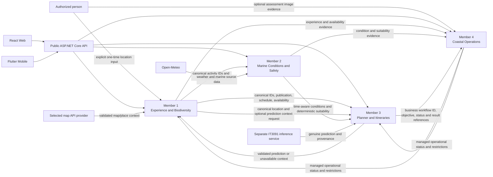
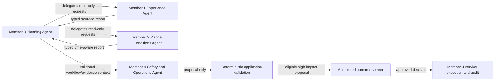

# v1 component relationships and integration map

This document shows which v1 member components own information and which
other components consume it. The arrows describe contract and data
relationships. **They do not prescribe the order in which members implement
their components.** Each member develops the complete component on one branch
in parallel with the other members; see the
[member branch and integration workflow](member-branch-workflow.md).

Use this map with the [four detailed component contracts](README.md#component-and-agent-contract-map),
their [member work plans](README.md#component-and-agent-contract-map), the
[shared business workflows](workflows.md), and the
[Agentic AI integration boundary](agentic-ai-integration-boundary.md).
Requirements, accepted repository contracts and implementation sources remain
authoritative.

Each member owns one internal .NET microservice in its own `services/`
subfolder. The existing public API integrates and routes to those services but
does not hold their business logic; Auth remains reused. See
[ADR-0020](../adr/ADR-0020-member-component-service-boundaries.md).

## Component contract relationships

The arrows between member components mean that the consumer depends on the
producer's agreed contract and authoritative data. They do not require a
direct client connection or prescribe whether backend code uses an internal
application interface, a typed service client or another accepted boundary.
React and Flutter call only the public API. The selected map provider and
Open-Meteo are called through their owning ASP.NET Core adapters; the private
biodiversity inference service is called through Member 3's ASP.NET Core
adapter. Auth, PostgreSQL and any later Agentic AI service remain behind
their approved backend boundaries. Map-provider output
supports discovery/display only and never becomes the authority for Member
1's canonical destination records.

## Producer, consumer and authority map

| Producer / source of truth | Consumer | Relationship and handoff | Rule the consumer preserves |
|---|---|---|---|
| **Member 1 — Experience catalogue** | Member 2 — Marine and safety | Canonical activity IDs and activity taxonomy used to associate safety profiles and assessments with the right activity. | Member 2 references Member 1 activity identity and does not create a competing activity catalogue. |
| **Member 1 — Experience catalogue** | Member 3 — Planner | Canonical destination/activity/offering IDs, location, publication state, schedule and effective availability. | Planner recommendations reference Member 1 records and never make an unpublished or unavailable offering usable. |
| **Member 1 — Experience catalogue** | Member 4 — Operations | Managed-target references plus experience, schedule and availability evidence for the affected operation. | Member 4 references Member 1 identities and evidence; it does not create a competing catalogue. |
| **Member 4 — Operations** | Member 1 — Experience catalogue | Current authoritative operational state, restrictions, version and applicable time context. | Member 1 combines operational state with its own publication, schedule and availability rules. Missing or stale status must use the agreed uncertainty/failure behavior. |
| **Member 4 — Operations** | Member 3 — Planner | Current operational restrictions for candidate eligibility and re-evaluation. | Planner excludes or clearly handles restricted operations; recommendations cannot override Member 4 state. |
| **Member 2 — Marine and safety** | Member 3 — Planner | Conditions with source, units, observation/forecast time, retrieval time, freshness and missing factors; deterministic suitability with profile/version evidence. | Planner preserves `UNSUITABLE`, `UNKNOWN`, stale and missing-data meaning. It does not recalculate or weaken Member 2 thresholds. |
| **Member 2 — Marine and safety** | Member 4 — Operations | Time-aware environmental evidence and the deterministic suitability assessment for the relevant activity and period. | Member 4 keeps source/freshness/missing evidence visible and cannot turn an unsuitable or unknown result into a permissive one. |
| **Member 3 — Planner** | Member 4 — Operations | Business workflow ID, objective/request context, initiator and authorized status/result references; itinerary or recommendation context where relevant. | Member 4 links to Member 3's business workflow identity without claiming that it is an Agentic AI execution record. |
| **Member 3 — biodiversity integration** | Member 1 — Experience and biodiversity | Validated prediction context or explicit not-requested/unavailable/invalid result for a relevant canonical destination/activity location. | Member 3 owns the private IT3091 adapter and public result contract; Member 1 owns the user-facing presentation. Preserve provenance and uncertainty. Prediction context is optional and never evidence of observed presence, safety, availability or operational authority. |
| **Open-Meteo** | Member 2 — Marine and safety | Weather and marine observations/forecasts requested by the backend adapter. | Member 2 validates and normalizes data, preserves provenance and reports provider failure explicitly. Clients never call the provider. |
| **Selected map API provider** | Member 1 — Experience and biodiversity | Map/place/geocoding or other location context for the explicitly selected discovery features. | Member 1's private service owns the BLUEVERSE consumer adapter; the public API mediates client access. Provider results are untrusted and cannot create or overwrite canonical destinations. Provider choice and feature scope remain open. |
| **IT3091 biodiversity model/inference workstream** | External supplier; Member 3 owns BLUEVERSE integration | A genuine model-backed prediction and supplied model/provenance/uncertainty metadata through a private inference API. | The IT3091 workstream supplies the trained model/service. Member 3's private service owns the consumer adapter and validated public result contract, not the model/service implementation. Member 1 consumes the result for user-facing context. This ML integration is separate from Agentic AI and is implemented before G07. |
| **Authorized person/device location** | Member 1 — Experience and biodiversity | A user-initiated, one-time device reading or manually selected destination/region used as a nearby-discovery input. | Member 1's service validates the query routed through the public API; location is not background-tracked or retained as a movement history. Device coordinates are not canonical destination data. |
| **Authorized operator image evidence** | Member 4 — Coastal operations | Optional image evidence attached to a BLUEVERSE-managed assessment/version and displayed to authorized reviewers. | Member 4 owns upload authorization, private storage, content validation, versioning and audit. Raw media is not public and is not passed to the future Agentic AI agent. |

The first nine rows describe the internal BLUEVERSE component relationships;
the next three describe external data/model relationships; the final two
define human/device inputs. Member 2's requested condition period remains an
ordinary marine-query input, not a separately assigned device capability.
Each component's API,
permission, validation, persistence, client parity, error and acceptance
requirements are detailed in its linked contract.

## Why the relationships form a graph, not a member sequence

The contracts intentionally connect in more than one direction:

- Member 1 needs Member 4's current managed-operation status to calculate
  effective availability, while Member 4 needs Member 1's managed-target
  identity and experience evidence.
- Member 3 consumes Member 1 availability, Member 2 suitability and Member 4
  restrictions to assemble deterministic recommendations.
- Member 2 uses Member 1's canonical activity taxonomy when associating
  safety profiles and suitability assessments with activities. Its requested
  period is a normal query field; Member 3 remains the source of the validated
  candidate period for planner-originated assessment. Member 2 has no
  separate device-feature assignment.
- Member 1 supplies canonical location context when relevant; Member 3 owns
  the optional IT3091 request/response adapter and returns only a validated
  result or explicit unavailability. Member 1 owns its display, and neither
  Member 4 nor the Agentic runtime may use that prediction as safety authority.
- Member 4 consumes Member 1/2 evidence and Member 3's business workflow
  identity to create an auditable assessment and proposal record.
- Member 2 can establish data acquisition and condition normalization while
  the other components develop their own contracts; activity-specific
  interpretation must agree with Member 1's activity taxonomy.

These relationships do not imply that one member must finish before another
starts. At G00, members agree on the shared IDs, data ownership, public
contracts, permission/error conventions, time semantics and workflow/status
meaning. Each member then implements the complete owned component on its own
branch. Consumers may use the agreed contracts while all branches are in
progress. The provider/consumer behaviors are checked together after the
feature PRs are merged to `dev`, and any compatibility corrections are made
there before the team accepts G07.

## Agentic AI relationship layer

Before G07, each member feature prepares its public workflow API and its
server-side typed adapter, availability check and safe not-connected or
unavailable result for the paired future AI role. This is the backend access
boundary, not the executable AI component. The
[integration contract](agentic-ai-integration-boundary.md) defines the
distinction in full.

After all four member components are integrated and pass G07, actual agents,
tools, prompts/model calls, orchestration and AI-owned execution state are
implemented through `agentic-ai/**` branches:

The AI layer consumes the member-owned APIs and evidence. It does not own the
catalogue, deterministic suitability thresholds, operational records,
permissions or protected execution. The [branch workflow](member-branch-workflow.md)
contains the G07 gate and the post-gate AI work sequence. The shared
[Agentic AI implementation blueprint](../agentic-ai/implementation-blueprint.md)
defines model/provider and retrieval choices, state, tools, safety, deployment
and acceptance without treating an unselected technology as a requirement.

## Member work plans

The four member plans give full-scope checklists and implementation details
for one branch per owner. Their numbered work areas group the component
contract and expose local data/contract dependencies; they are not separate
branches, PRs or global member start dates.

- [Member 1 — Experience and Biodiversity](phases/member-1-phase-plan.md)
- [Member 2 — Marine Conditions and Safety](phases/member-2-phase-plan.md)
- [Member 3 — Planner and Itineraries](phases/member-3-phase-plan.md)
- [Member 4 — Coastal Operations](phases/member-4-phase-plan.md)
